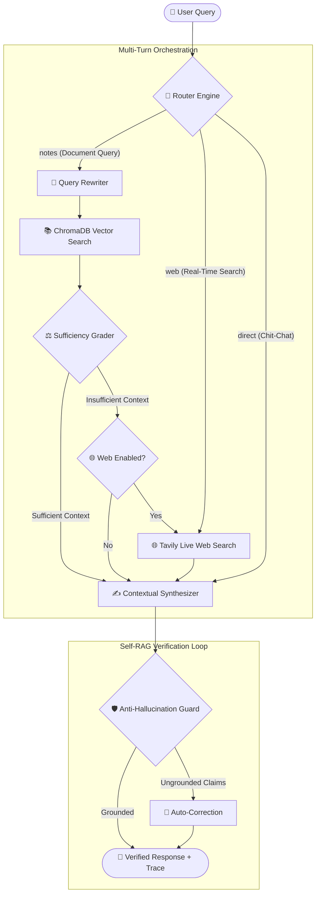

# ⚡ IntelliNotes — Enterprise Agentic RAG Knowledge Engine

[](https://www.python.org/)
[](https://fastapi.tiangolo.com/)
[](https://langchain-ai.github.io/langgraph/)
[](https://www.trychroma.com/)
[](https://ai.google.dev/)
[]()
[](LICENSE)

**IntelliNotes** is an advanced **Agentic RAG (Retrieval-Augmented Generation)** knowledge system built with **LangGraph, FastAPI, Streamlit, ChromaDB, Google Gemini Flash-Lite, and Tavily**.

Unlike simplistic naive-RAG bots that blindly dump embeddings into a prompt, IntelliNotes operates as an autonomous cognitive loop featuring **multi-intent query routing, multi-turn conversational query rewriting, page-accurate document retrieval, strict context sufficiency grading, live web fallback, and a Self-RAG anti-hallucination guard**.

---

## 🏛️ System Architecture



---

## ✨ Key Engineering Differentiators (Why This is Resume-Worthy)

1. **🛡️ Zero-Hallucination Self-RAG Guard**:
   - Every synthesized answer passes through an independent grounding verifier that audits claims against source excerpts before returning to the user.
   - If ungrounded or speculative statements are detected, the guard auto-corrects the output to keep it faithful to the source material.
   - Honest verdict states only: `VERIFIED` / `CORRECTED` / `UNVERIFIED` / `SKIPPED` — the system never labels an unchecked answer as verified, and a deterministic safety net rejects any "correction" that would strip an honest refusal and replace it with new content.
   - The guard is the single authority for persisting the final assistant message, so a correction replaces the hallucinated answer in memory instead of leaving both in the conversation history.

2. **📄 Page-Aware PDF Ingestion & Exact Citations**:
   - Chunks retain original PDF page numbers (`Page X`).
   - Answers and observability traces provide exact document citations: `[Document: quarterly_report.pdf, Page: 4]`.

3. **🎯 Document-Scoped Vector Isolation**:
   - Supports chatting with "All Documents" or scoping queries strictly to a specific uploaded PDF (`doc_id`), eliminating cross-document context contamination.
   - When the scoped documents cannot answer the question, the agent says so explicitly instead of summarizing unrelated content.

4. **🔄 Multi-Turn Conversational Memory & Condensation**:
   - Powered by LangGraph's persistent `SqliteSaver` checkpointing.
   - Ambiguous follow-ups (e.g. *"What were the three key challenges mentioned earlier?"*) are dynamically rewritten into standalone search queries before vector lookup.

5. **🔍 Full Observability (Live Agent Trace)**:
   - Every user message comes with an inspectable DAG execution trace detailing routing decisions, retrieved chunks, sufficiency grades, web search queries, and anti-hallucination verdicts.

6. **🧯 Graceful Degradation**:
   - If the routing or grading model is temporarily unavailable (quota, network, 5xx), the agent degrades to deterministic keyword routing and safe grading defaults instead of failing the conversation.
   - Uploads are size-limited (HTTP 413) and sparse/empty PDFs are rejected cleanly (HTTP 400) rather than crashing the API.

---

## 🗂️ Project Structure

```text
IntelliNotes/
├── backend/
│   ├── app/
│   │   ├── agent/                 # LangGraph Agentic Workflow
│   │   │   ├── grader.py          # LLM Sufficiency Evaluator
│   │   │   ├── graph.py           # Compiled StateGraph & Checkpointer
│   │   │   ├── grounding.py       # Self-RAG Anti-Hallucination Verifier
│   │   │   ├── retriever.py       # Scoped Vector Retriever & Query Rewriter
│   │   │   ├── router.py          # Semantic Intent Router
│   │   │   ├── state.py           # TypedDict AgentState
│   │   │   ├── synthesize.py      # Grounded Answer Synthesizer
│   │   │   └── websearch.py       # Tavily Web Fallback Node
│   │   ├── core/                  # Core LLM & Embeddings Setup
│   │   │   ├── embeddings.py      # Google Generative AI Embeddings
│   │   │   ├── llm.py             # Gemini 3.5 Flash Client with Retries
│   │   │   └── prompts.py         # Grounded System Prompts
│   │   ├── ingestion/             # PDF Processing & Vector Indexing
│   │   │   ├── loader.py          # Page-preserving PDF parser & chunker
│   │   │   └── vectorstore.py     # Thread-safe ChromaDB client & CRUD
│   │   ├── config.py              # Pydantic Settings
│   │   ├── main.py                # FastAPI Application & REST Endpoints
│   │   └── schemas.py             # Pydantic Request/Response Models
│   ├── requirements.txt           # Backend Dependencies
│   └── tests/                     # Automated Test Suite (24 unit & integration tests)
│       ├── test_agent.py          # Routing, Grading & Grounding tests
│       ├── test_api.py            # FastAPI endpoint integration tests
│       ├── test_loader.py         # PDF parsing & page-tracking tests
│       └── test_vectorstore.py    # Scoping, CRUD & isolation tests
├── frontend/
│   ├── app.py                     # Streamlit UI with Dark-Mode & Visual DAG Trace
│   └── requirements.txt           # Frontend Dependencies
├── scripts/
│   ├── verify_setup.py            # Diagnostic script to validate API keys & models
│   └── smoke_test.py              # Live end-to-end verification (needs running server)
├── .env.example                   # Environment configuration template
├── LICENSE                        # MIT License
└── README.md
```

---

## 🚀 Getting Started

### 1. Prerequisites
- Python 3.11+
- [Google AI Studio API Key](https://aistudio.google.com/apikey) (Free)
- [Tavily API Key](https://app.tavily.com/) (Free: 1,000 queries/month)

### 2. Environment Configuration
Create a `.env` file in the project root:
```env
GOOGLE_API_KEY=your-gemini-api-key
TAVILY_API_KEY=your-tavily-api-key
```

### 3. Verify System Setup
Run the built-in diagnostic test:
```bash
python scripts/verify_setup.py
```

### 4. Run the Backend API
```bash
uvicorn app.main:app --app-dir backend --reload --port 8000
```
Interactive OpenAPI documentation will be available at [http://localhost:8000/docs](http://localhost:8000/docs).

### 5. Run the Streamlit UI
In a separate terminal:
```bash
streamlit run frontend/app.py
```
Open [http://localhost:8501](http://localhost:8501) in your browser.

---

## 🧪 Automated Testing

Run the full pytest suite (50 unit & integration tests, fully mocked — no API cost):
```bash
pytest backend/tests -v
```

For live verification against the real Gemini + Tavily services (requires the
backend running and valid API keys; consumes a small amount of API quota):
```bash
python scripts/smoke_test.py
```

The live smoke test generates two synthetic PDFs, exercises page-aware retrieval,
multi-turn follow-ups, honest refusals for absent information, document scoping
isolation, conversation-memory integrity, and cleans up after itself.

Output (50 tests):
```text
backend/tests/test_agent.py::test_router_node_notes_path PASSED
backend/tests/test_agent.py::test_router_node_empty_store_fallback PASSED
backend/tests/test_agent.py::test_grade_node_no_documents PASSED
backend/tests/test_agent.py::test_grade_node_with_documents PASSED
backend/tests/test_agent.py::test_grade_node_model_error_defaults_sufficient PASSED
backend/tests/test_agent.py::test_grounding_check_node_skipped_on_direct PASSED
backend/tests/test_agent.py::test_grounding_check_node_verified PASSED
backend/tests/test_agent.py::test_grounding_check_node_corrected PASSED
backend/tests/test_agent.py::test_grounding_check_node_unverified_without_correction PASSED
backend/tests/test_agent.py::test_looks_like_refusal[...] PASSED (5 cases)
backend/tests/test_agent.py::test_grounding_rejects_correction_that_strips_refusal PASSED
backend/tests/test_agent.py::test_grounding_accepts_correction_that_keeps_refusal PASSED
backend/tests/test_agent.py::test_grounding_correction_replaces_history_not_appends PASSED
backend/tests/test_agent.py::test_heuristic_route[...] PASSED (8 cases)
backend/tests/test_agent.py::test_decide_route_falls_back_to_heuristic_on_model_error PASSED
backend/tests/test_agent.py::test_synthesize_node_appends_insufficient_context_note PASSED
backend/tests/test_agent.py::test_synthesize_node_skips_note_when_sufficient PASSED
backend/tests/test_agent.py::test_synthesize_node_skips_note_when_web_results_rescued PASSED
backend/tests/test_agent.py::test_build_graph_structure PASSED
backend/tests/test_api.py::test_root_endpoint PASSED
backend/tests/test_api.py::test_health_endpoint PASSED
backend/tests/test_api.py::test_upload_non_pdf_rejected PASSED
backend/tests/test_api.py::test_upload_pdf_success PASSED
backend/tests/test_api.py::test_upload_sparse_pdf_returns_400_not_500 PASSED
backend/tests/test_api.py::test_upload_oversized_rejected PASSED
backend/tests/test_api.py::test_chat_endpoint_success PASSED
backend/tests/test_api.py::test_chat_missing_grounding_verdict_returns_null PASSED
backend/tests/test_api.py::test_delete_document PASSED
backend/tests/test_api.py::test_clear_all_documents PASSED
backend/tests/test_loader.py::test_clean_text PASSED
backend/tests/test_loader.py::test_chunk_text_basic PASSED
backend/tests/test_loader.py::test_chunk_text_short PASSED
backend/tests/test_loader.py::test_extract_pdf_pages PASSED
backend/tests/test_loader.py::test_load_pdf_chunks_success PASSED
backend/tests/test_loader.py::test_load_pdf_chunks_empty_raises_error PASSED
backend/tests/test_loader.py::test_load_pdf_chunks_too_sparse_raises_error PASSED
backend/tests/test_vectorstore.py::test_add_and_count_chunks PASSED
backend/tests/test_vectorstore.py::test_search_notes_and_scoping PASSED
backend/tests/test_vectorstore.py::test_list_and_delete_document PASSED

======================== 50 passed in 4.19s ========================
```

---

## 📡 REST API Reference

| Method | Endpoint | Description |
|---|---|---|
| `POST` | `/upload-document/` | Upload a PDF; extracts pages, embeds vectors, and indexes in ChromaDB |
| `POST` | `/chat/` | Query the agent; accepts `session_id`, `message`, `web_enabled`, and `doc_id` |
| `GET` | `/documents` | List all indexed documents with their chunk counts and document IDs |
| `DELETE` | `/documents/{doc_id}` | Delete a specific document and its vector chunks |
| `DELETE` | `/documents/` | Clear all documents from the vector database |
| `GET` | `/health` | Health check returning status and total chunks in store |

---

## 📜 License
Licensed under the [MIT License](LICENSE).
